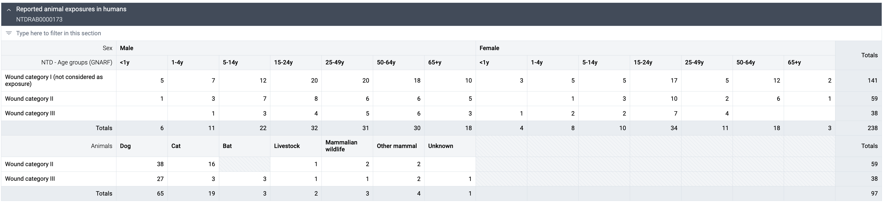
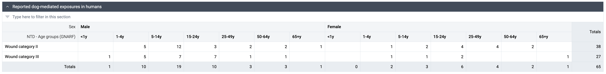
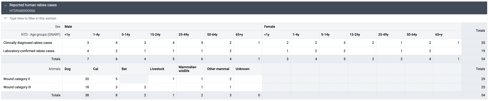
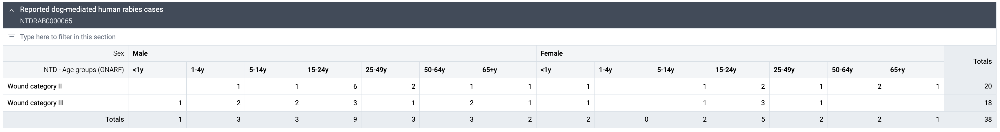
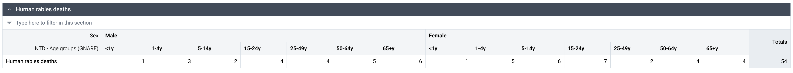
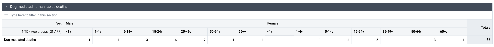
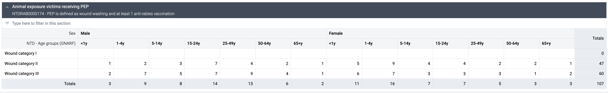

# NTD Human Rabies Surveillance - Aggregate Design { #ntd-hrs-agg-design }

## Background and Purpose

The Human Rabies Disease-Specific Dataset Module offers a detailed framework tailored for tracking, reporting, and analyzing human rabies cases within countries' health management information systems (HMIS). As an extension of the core NTD Overarching Module, this dataset is designed for countries and facilities with advanced data collection and analytical capabilities, enabling a more granular approach to routine rabies surveillance and control.

Intended for use by DHIS2 implementers at national, regional, and local levels, this module provides a structured dataset aligned with WHO’s recommendations and best practices for human rabies surveillance. It allows for flexibility in adapting the metadata to align with national guidelines and specific workflows, thereby supporting countries in meeting their own reporting standards and regulatory requirements.

The Human Rabies Disease-Specific Dataset encompasses data points essential for comprehensive surveillance, including case classification, patient demographics, exposure details, treatment and post-exposure prophylaxis (PEP) administration, and outcomes. This structure promotes the collection of high-resolution data that can facilitate more accurate tracking of rabies transmission patterns, assess PEP efficacy, and inform targeted interventions. Countries and regions adopting this dataset will have the capacity to produce in-depth analyses, enabling more responsive decision-making and enhancing the effectiveness of rabies control and elimination efforts.

By utilizing this specialized dataset, countries can advance their contributions toward the WHO 2021–2030 NTD Road Map goals  [WHO, 2021](https://www.who.int/publications/i/item/9789240010352), specifically the target to eliminate human rabies deaths in endemic countries by 2030. Through standardized, high-quality data collection and reporting, health systems can strengthen their response to rabies, ultimately reducing the disease’s impact on affected populations.

## System Design Overview

### Data set Structure

Human Rabies Surveillance aggregate data set consists of four main sections with sub-sections.

Exposures and cases are disaggregated by WHO Wound Categories, GNARF age groups, sex and type of animal.

- **WHO Wound Category I** is defined as animal licks on intact skin, touching or feeding the animal.

- **WHO wound category II** is defined as minor scratches or abrasions, nibbling of uncovered skin.

- **WHO wound category III** is defined as transdermal bites or scratches, licks on broken skin, contamination of mucous membrane with saliva, exposure to a bat.

- **Clinically diagnosed** cases are defined as cases that show clinical symptoms aligned with the human case definition and have a reliable history of contact to an animal susceptible to rabies.

- **Laboratory confirmed** cases are defined as cases that have a positive laboratory result.

- **Post-exposure prophylaxis (PEP)** is defined as wound washing and at least 1 anti-rabies vaccination.

- Reported animal exposures in humans
  - Reported dog-mediated exposures in humans

- Reported human rabies cases
  - Reported dog-mediated human rabies cases
 

- Human rabies deaths
  - Dog-mediated human rabies deaths
 

- Animal exposure victims receiving PEP

### User Groups

As part of the package configuration, user groups have been created to be used to manage metadata sharing settings. Core metadata that use these sharing settings include data sets, dashboards, indicators and data elements. The three user groups are listed below:

| **User group**       | **Dashboard**        | **Metadata**        | **Data**               |
|-----------------------|----------------------|----------------------|-------------------------|
| NTD - Admin          | Can edit and view    | Can edit and view    | Can view only          |
| NTD - Access         | Can view only        | Can view only        | Can view only          |
| NTD - Data capture   | No access            | Can view only        | Can capture and view   |

### Supporting Metadata

### Dashboard Design

## Special Considerations

### Integration with Overarching NTD Module

Data collected in the Human Rabies Surveillance data set can be used to feed the data in the overarching Neglected Tropical Diseases data set. The mapping between the two data sets is provided below.

The metadata package contains a Data Exchange configuration that can be run in the core Data Exchange app. Data exchange can be triggered manually or scheduled to run periodically.

### Integration with Human Rabies Surveillance Tracker

If implemented, DHIS2 Human Rabies Surveillance tracker may replace registers and tally sheets to populate all variables in the aggregate data set at any hierarchical level. The metadata package contains a Data Exchange configuration that can be run in the core Data Exchange app. Data exchange can be triggered manually or scheduled to run periodically. Data exghange may be configured to send data internally within one instance of DHIS2 or externally to push data from the tracker instance to the instance with the aggregate data set. Default configuration is set to internal monthly data exchange on facility level.
