# Human Rabies Surveillance { #ntd-rab-design }

## Work-in-progress notes

1. Rabies deaths are counted by the date of exposure and not by the date of outcome to ensure the numerator and denominator values for Mortality indicators belong to the same reporting periods.

## Flowchart

```mermaid

---
title: Human Rabies Surveillance
---
%%{init: {'mirrorActors': false } }%%

flowchart TB
  subgraph A[Health facility level]
      direction TB
        subgraph A1[Registration of a reported human rabies case]
          id1[- Date of registration <br> - Date of exposure <br> - National ID <br> - First name <br> - Last name <br> - Date of birth <br> - Sex <br> - Address <br> - Contact number <br> - Email <br> - Case ID]
        end
  end
  subgraph B[Case Assessment]
      direction TB
        subgraph A2[Wound risk assessment]
          id2[- Date of exposure <br> - Animal type <br> - Patient health status <br> - Animal health status <br> - Wound information <br> - Wound classification]
        end
        subgraph A3[Animal information]
          id3[- Rabies symptoms <br> - Animal tessting <br> - Animal availability <br> - Animal vaccination history <br> - Animal provocation <br> -Animal exposure history]
        end
        subgraph A4[Patient information, symptoms, vaccination history, diagnostic testing]
          id4[- Age <br> - Weight <br> - Symptoms <br> - Date of vaccination <br> - Anatomical location of vaccination <br> - Product name <br> - Adverse effects <br> - Common encephalitis cause <br> - Date of testing <br> - Test type  <br> - Test result <br> - Comments]
        end
        subgraph A5[Exposure location and contacts]
          id5[- Exposure location <br> - Other humans or animals exposed]
        end
        A2---A3---A4---A5
  end
  subgraph C[Assessment determination]
  style C fill:#7393B3,stroke:#333,stroke-width:4px
    id6[- Species risk determination <br> - Rabies PEP recommendation <br> - RIG recommendation <br> - ARV recommendation <br> - Assessment comments]
  end
  subgraph D[Diagnostic testing - patient]
  style C fill:#7393B3,stroke:#333,stroke-width:4px
    id7[- Diagnostic testing]
  end
  subgraph E[Clinic Visits]
      direction LR
        subgraph B1["Clinic visit 1 (takes place at the same time as case assessment)"]
            direction TB
              subgraph B1A[PEP - Rabies immunoglobulin]
                idB1[- RIG/RmAbs kind <br> - Product details <br> - Amount recommended <br> - Amount administered <br> - Anatomical location of administration]
              end
              subgraph B1B[PEP - Anti-rabies vaccine]
                idB2[- ARV series <br> - Vaccination site <br> - Product details]
              end
              subgraph B1C[Adverse reactions]
                idB3[Adverse reactions to RIG/RmAbs and ARV]
              end
              subgraph B1D[Next visit data]
                idB4[- Site deviation <br> - Date of next visit <br> - Comments]
              end
              B1A---B1B---B1C---B1D
        end
        subgraph B2[Clinic visits 2-3]
            direction TB
              subgraph B2A[Status]
                idB5[- Date deviation <br> - Days since exposure <br> - Animal health status <br> - Animal symptoms <br> - Animal availability <br> - Animal test results]
              end
              subgraph B2B[Assessment determination]
              style B2B fill:#7393B3,stroke:#333,stroke-width:4px
                idB6[- Rabies PEP recommendation]
              end
              subgraph B2C[PEP - Rabies immunoglobulin]
                idB7[- RIG/RmAbs kind <br> - Product details <br> - Amount recommended <br> - Amount administered <br> - Anatomical location of administration]
              end
              subgraph B2D[PEP - Anti-rabies vaccine]
                idB8[- Date deviation <br> - ARV series <br> - Vaccination site <br> - Product details]
              end
              subgraph B2E[Adverse reactions]
                idB9[Adverse reactions to RIG/RmAbs and ARV]
              end
              subgraph B2F[Next visit data]
                idB10[- Schedule deviation <br> - Date of next visit <br> - Comments]
              end
              B2A---B2B---B2C---B2D---B2E---B2F
        end
        subgraph B3[Clinic visit 4]
            direction TB
              subgraph B3A[Status]
                idB11[- Date deviation <br> - Days since exposure <br> - Animal health status <br> - Animal symptoms <br> - Animal availability <br> - Animal test results]
              end
              subgraph B3B[Assessment determination]
              style B3B fill:#7393B3,stroke:#333,stroke-width:4px
                idB12[- Rabies PEP recommendation]
              end
              subgraph B3C[PEP - Anti-rabies vaccine]
                idB13[- Date deviation <br> - ARV series <br> - Vaccination site <br> - Product details]
              end
              subgraph B3D[Adverse reactions]
                idB14[Adverse reactions to RIG/RmAbs and ARV]
              end
              subgraph B3E[PEP status]
                idB15[- Schedule deviation <br> - Date of next visit <br> - Comments]
              end
              B3A---B3B---B3C---B3D---B3E
        end
        subgraph B4[Clinic visit 5]
            direction TB
              subgraph B4A[Status]
                idB16[- Date deviation <br> - Days since exposure <br> - Animal health status <br> - Animal symptoms <br> - Animal availability <br> - Animal test results]
              end
              subgraph B4B[Assessment determination]
              style B4B fill:#7393B3,stroke:#333,stroke-width:4px
                idB17[- Rabies PEP recommendation]
              end
              subgraph B4C[PEP - Anti-rabies vaccine]
                idB18[- Date deviation <br> - ARV series <br> - Vaccination site <br> - Product details]
              end
              subgraph B4D[Adverse reactions]
                idB19[Adverse reactions to RIG/RmAbs and ARV]
              end
              subgraph B4E[PEP status]
                idB20[- Schedule deviation <br> - Comments]
              end
              B4A---B4B---B4C---B4D---B4E
        end
    B1 --> B2 --> B3 --> B4
    end
  subgraph F[PEP Completion]
    direction TB
        subgraph E1[Exposure summary]
          id25[- Days since exposure <br>]
        end
        subgraph E2[PEP Completion]
          id26[- PEP Status <br> - Rabies diagnosis <br> - Comment]
        end
        E1---E2
  end
  A --> B --> C --> D --> E --> F

```

